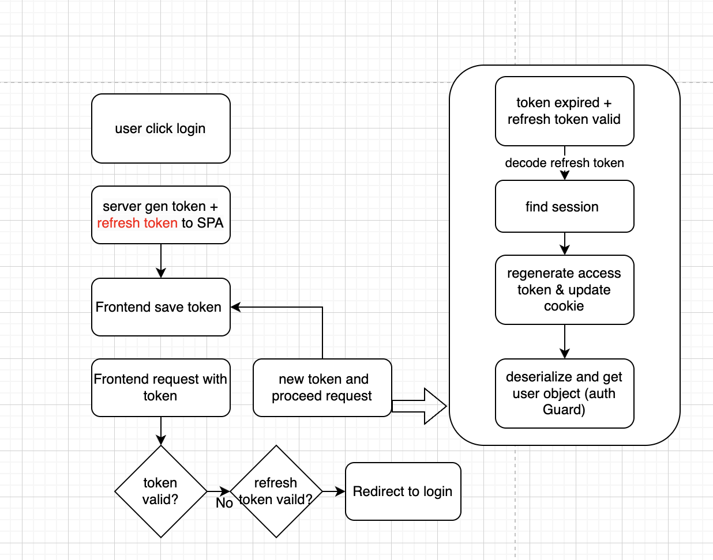

### handle JWT token in logout section

- JWT is stateless, meaning jwt is not stored in server/backend. JWT issues and validates the token by itself. thus, it is not possible to "destroy" the token at the server side.

#### Frontend

- Upon log out, delete the stored token from the client-side to prevent further usage. and wait until the token expired.
- before expiry, this token will still be valid and can be used in other microservices, and this could be a potential risk in some cases when a higher security level is needed.

### backend

- if we require a strict log out functionality that cannot rely on token auto-expiration, we can consider the following solution:

> silent refresh<!-- prettier-ignore -->
{:.prompt-tip}

- Silent refresh is a mechanism to generate new access token from refresh token automatically in the event of browser refresh or when access token is expired but refresh token is available and valid.



- for each request after the `deserializeUser` middleware, we will add `user` object to request and request without such object will be returned with `403` `unauthorized`.

```ts
type DecodeUser = {
  sessionId: string;
  email: string;
  valid: boolean;
  name: string;
} | null;
interface JWTRequest extends Request {
  user: DecodeUser;
}
export const deserializeUser = (
  req: JWTRequest,
  res: Response,
  next: NextFunction
) => {
    const { accessToken, refreshToken } = req.cookies;
  // if cookie is valid
  const decode = verifyJWT<DecodeUser>(accessToken);
  if (!decode) {
    return next();
  }
  const { expired, payload } = decode;
  if (!expired) {
    req.user = payload;
    return next();
  }
```

- when access token expired, we will need to check refresh token,and by decoding refresh token, we will get the `session id` of current session,if refresh token is not expired. Then we retrieve current session from DB.
- sign and decode with jwt, we will have the new `access token` and the new `user` object respectively. and we will use the new access token for http request, and `user` object to stop unauthorized access.

```ts
// handle expired token
type Refresh = {
  sessionId: string;
};
const { payload: refresh } =
  expired && refreshToken
    ? verifyJWT<Refresh>(refreshToken)
    : { payload: null };
if (!refresh) {
  return next();
}
const session = getSession(refresh.sessionId);
if (!session) {
  return next();
}
const newToken = signJWT(session, "5s");

req.user = verifyJWT<DecodeUser>(newToken).payload;
res.cookie("accessToken", newToken, {
  maxAge: 500000,
  httpOnly: true,
});

return next();
```

1. Set a reasonable expiration time on tokens to enforce automatic expiration with a silent refresh.

> Implement a "Blacklist" mechanism to track invalidated tokens.<!-- prettier-ignore -->
{:.prompt-tip}

2. This can be achieved by using a database with a TTL (Time-to-Live) feature, where each token is stored with an expiration time.

> consider using Redis<!-- prettier-ignore -->
{:.prompt-tip}

3.Redis is a fast in-memory database, for efficient Blacklist management and token validation.By implementing this approach, we can add an extra layer of security and ensure that unauthorized or invalidated tokens are rejected during authorized requests.
